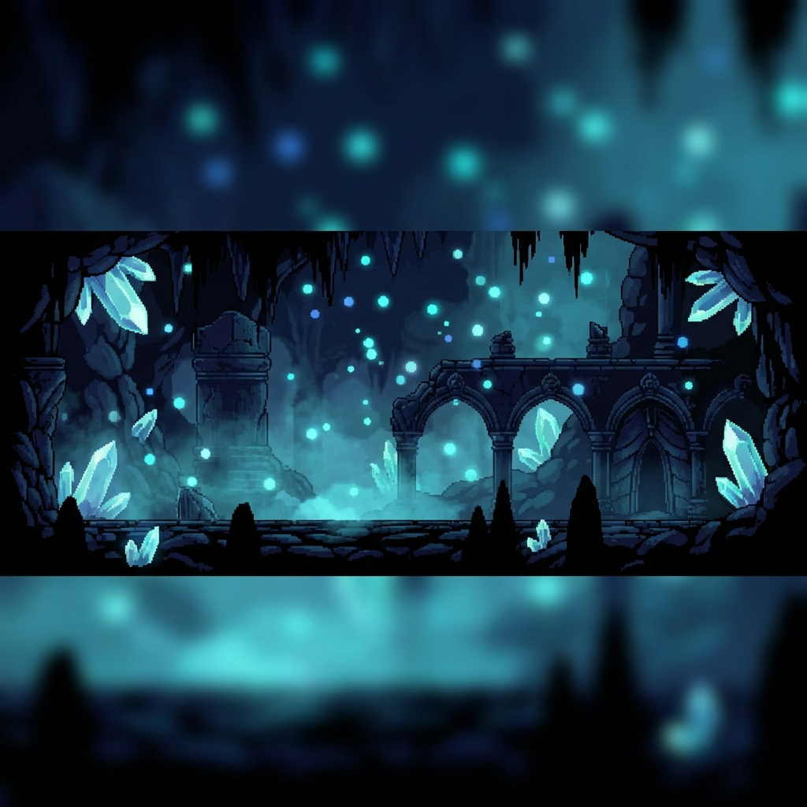

<div align="center">

  

  <br/><br/>

  

  <div align="left">
    <h1>BakaAayush</h1>
    <h3><code>[ CLASS: Aspiring Full-Stack Mage ]</code> &nbsp; <code>[ ARCHETYPE: The Curious Novice ]</code></h3>
    <p>
      <em>"Every master was once a disaster. The journey has just begun."</em>
    </p>
    <p>
      <a href="https://github.com/BakaAayush">
        
      </a>
      <a href="#">
        
      </a>
      <a href="#">
        
      </a>
      <a href="#">
        
      </a>
    </p>
  </div>
</div>

<br clear="left"/>

---

### ◈ CHARACTER MENU

<details>
<summary><strong>📊 ATTRIBUTES — Base Stats</strong></summary>
<br/>

| Attribute | Level | Proficiency Bar | Status |
| :--- | :---: | :--- | :---: |
| **INT** (Logic) | **25** | `█████░░░░░░░░░░░░░░░` | *Learning* |
| **WIS** (Problem Solving) | **20** | `████░░░░░░░░░░░░░░░░` | *Growing* |
| **DEX** (Typing Speed) | **45** | `█████████░░░░░░░░░░░` | *Decent* |
| **CHA** (Communication) | **50** | `██████████░░░░░░░░░░` | *Friendly* |
| **END** (Focus) | **35** | `███████░░░░░░░░░░░░░` | *Training* |
| **LUCK** (Bug-Free Deploy) | **10** | `██░░░░░░░░░░░░░░░░░░` | *Pray* |

> *Passive Effect: +20% Learning Speed when consuming tutorials at 2x speed.*

</details>

<details>
<summary><strong>🔮 SKILL TREE — Abilities in Training</strong></summary>
<br/>

<div align="center">

**// UNLOCKED ABILITIES //**
<br/>


<br/><br/>

**// CURRENTLY LEARNING //**
<br/>


<br/><br/>

**// NEXT IN QUEUE //**
<br/>


<br/><br/>

**// FUTURE ABILITIES — Locked //**
<br/>


</div>

<br/>

```
┌──────────────────────────────────────────────────────────────┐
│  SKILL PATH:  Novice → Full-Stack Developer → AI Engineer   │
└──────────────────────────────────────────────────────────────┘
```

</details>

<details>
<summary><strong>🎒 INVENTORY — Current Equipment</strong></summary>
<br/>

| Slot | Item Name | Rarity | Effect |
| :--- | :--- | :--- | :--- |
| **Main Weapon** | `VS Code` | 🟦 Rare | `+25 Syntax Highlighting` |
| **Armor** | `Windows 11` | 🟩 Common | `+10 Compatibility` |
| **Headgear** | `Budget Headphones` | ⬜ Basic | `+5 Focus` |
| **Accessory** | `Google & Stack Overflow` | 🟪 Legendary | `+999 Problem Solving` |
| **Consumable** | `Chai / Coffee` | ⬜ Basic | `Restores 15 MP` |

> *Legendary items are always equipped in the inventory of every developer.*

</details>

<details>
<summary><strong>📖 SPELLBOOK — Tools & Resources</strong></summary>
<br/>

<div align="center">


</div>

<br/>

| Spell | Description | Cooldown |
| :--- | :--- | :---: |
| `console.log()` | Debug any situation | None |
| `Ctrl + Z` | Undo mistakes (before commit) | Instant |
| `Ctrl + C / V` | Ancient art of code borrowing | None |
| `git push --force` | Forbidden spell. Use with caution. | ∞ |

</details>

<br/>

---

### 📜 QUEST LOG

<details open>
<summary><strong>⚔️ ACTIVE QUESTS</strong></summary>
<br/>

**🔥 MAIN QUEST: The Path of the Full-Stack**
> *Master the arts of frontend and backend development.*

- [ ] Complete HTML & CSS fundamentals
- [ ] Learn JavaScript deeply
- [ ] Build first React application
- [ ] Understand Node.js & Express
- [ ] Create & deploy portfolio website

<br/>

**💎 SIDE QUESTS**
- [ ] Contribute to open source (first PR)
- [ ] Build 5 mini-projects
- [ ] Learn Git branching properly
- [ ] Set up a proper dev environment

<br/>

**🔮 FUTURE ARC: The AI Engineer Saga** *(Locked)*
> *Unlocks after completing Full-Stack questline.*

- [ ] Learn Python for AI/ML
- [ ] Understand neural networks
- [ ] Build first AI project
- [ ] Dive into LLMs and transformers

</details>

<details>
<summary><strong>✅ COMPLETED QUESTS</strong></summary>
<br/>

```
[x] Created GitHub account — "The First Step"
[x] Made first repository — "The Empty Canvas"
[x] Wrote first README — "The Introduction"
[x] Decided to learn programming — "The Awakening"
```

<br/>

**🏅 LEGENDARY QUEST COMPLETED**

| Quest | Description | Reward |
| :--- | :--- | :--- |
| **SinricPro Home Automation** | Built a complete IoT home automation system using ESP8266, Arduino, and SinricPro cloud platform. Voice control with Alexa/Google Home. | 🟪 `+50 XP` `IoT Badge` |

> *Every journey begins with a single commit.*

</details>

<br/>

---

### 🧩 PASSIVE TRAITS

| Trait | Description |
| :--- | :--- |
| **🎮 Gamer Soul** | Knowledge of `Hollow Knight`, `Elden Ring`, and indie game lore. +10 creativity. |
| **🎵 BGM Listener** | Codes better with `Lo-fi`, `Game OSTs`, or `Synthwave` playing. |
| **🌙 Night Owl** | Focus increases by +25% between `22:00` and `03:00`. |
| **📚 Tutorial Addict** | Watches tutorials at 2x speed. Learning never stops. |
| **🔥 Beginner's Fire** | Enthusiasm stat is at maximum. Fear of failure is low. |

<br/>

---

### 🏆 ACHIEVEMENT HALL

<details>
<summary><strong>📈 View Journey Statistics</strong></summary>
<br/>

<div align="center">


</div>
</details>

<br/>

<div align="center">

**// ACHIEVEMENTS UNLOCKED //**


</div>

<br/>

---

### 🌐 PARTY LINKS

<div align="center">

<a href="https://www.linkedin.com/in/aayush-anshuman-panda/">
  
</a>
&nbsp;
<a href="mailto:pandaayushanshuman@gmail.com">
  
</a>
&nbsp;
<a href="https://github.com/BakaAayush">
  
</a>

</div>

<br/>

---

<div align="center">

### 💾 SAVE POINT

```
┌─────────────────────────────────────────────────────────────────┐
│                                                                 │
│                    ░ PROGRESS SAVED ░                           │
│                                                                 │
│        "The road ahead is long, but every step counts.          │
│              Today's beginner is tomorrow's master."            │
│                                                                 │
└─────────────────────────────────────────────────────────────────┘
```

<br/>


<br/><br/>

<code>[ END OF FILE — The journey continues... ]</code>

</div>
